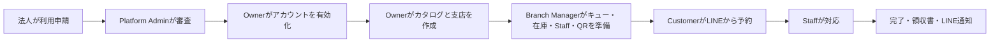

# ご利用・テストガイド

# LINE SMART QUEUE ASSISTANT

## 1. 本書の目的

本書は、山田様および大村様が、ソースコードを参照せずに LINE Smart Queue Assistant へアクセスし、機能を理解し、最初から最後まで体験・検証できるようにするためのエンドユーザー向けガイドです。

法人申込み、Platform Admin による審査、Organization Owner による初期設定、Branch Manager による店舗準備、LINE/LIFF からの予約、Staff による受付完了まで、実際の操作順に説明します。

掲載画像は、隔離されたローカル環境とデモデータで撮影した日本語 UI の共通画像です。画像内の氏名・メールアドレス・店舗情報はテスト専用であり、実在のお客様の情報ではありません。

## 2. アクセス情報

| 項目               | テスト時の値                                                           |
| ------------------ | ---------------------------------------------------------------------- |
| Production URL     | `[PRODUCTION URLを記入]`                                               |
| Test URL           | ローカルは `http://localhost:5173`、共有環境は `[TEST URLを記入]`      |
| サポートメール     | `support@smartqueue.io.vn`                                             |
| LINE公式アカウント | `[OA名またはリンクを記入]`                                             |
| 店舗QR             | ローカルでは Branch Manager の **QR表示**、共有環境は `[店舗QRを記入]` |
| ガイド作成日       | `2026/08/02`                                                           |
| 対象バージョン     | `[レビュー対象のリリースまたはコミットを記入]`                         |

> 共有環境でレビューする場合は、URL、対象バージョン、店舗QRをプロジェクト担当者に確認してください。許可なく production のQRでテストデータを作成しないでください。

## 3. テストアカウント

以下はローカルのデモデータ専用アカウントです。production では使用しないでください。

| ロール             | メール／アカウント                                              | パスワード               | 対象範囲                                               |
| ------------------ | --------------------------------------------------------------- | ------------------------ | ------------------------------------------------------ |
| Platform Admin     | `admin@gmail.com`                                               | `123456`                 | プラットフォーム全体、導入申請、組織                   |
| Organization Owner | `manager2@gmail.com`                                            | `123456`                 | デモ組織、商品・サービス、支店、支店管理者、操作ログ   |
| Branch Manager     | `manager@gmail.com`                                             | `123456`                 | 割り当てられた1支店のキュー、在庫、Staff、QR、営業時間 |
| Staff              | `staff@gmail.com`                                               | `123456`                 | 割り当てられた支店の受付業務                           |
| LINE Customer      | Mock LIFF: **LINEデモ顧客**、実機: テスター本人のLINEアカウント | システム用パスワードなし | LINE/LIFF で予約・受付番号を確認                       |

共有テスト環境のパスワードを文書に保存できない場合は、`[安全な経路で共有]` と記載し、別の安全な連絡手段で提供してください。production の認証情報は本書や不具合報告に記載しないでください。

## 4. システム概要

LINE Smart Queue Assistant は、「受付に並んでいるが、いつ自分の番になるか分からない」という課題を解決します。お客様は店舗の固定QRを読み取り、LINEで本人確認を行い、受付キューと商品・サービスを選択します。その後、前方人数と待ち時間目安を含む受付番号を受け取ります。

主な利用者は次のとおりです。

- **Business Applicant**：法人利用を申請します。
- **Platform Admin**：申請を審査し、承認または却下します。
- **Organization Owner**：組織共通の商品・サービスと支店を管理します。
- **Branch Manager**：割り当てられた1支店のキュー、在庫、Staff、QRを管理します。
- **Staff**：有効な受付番号を呼び出し、対応し、完了します。
- **Customer**：メール／パスワードではなく、LINE/LIFF を利用します。

お客様向け体験は LINE-first です。QRからLIFFを開き、LINE Loginで本人確認を行います。一方、LINE Messaging API は通知送信のための別機能であり、LINE Login が成功しても通知が必ず届くとは限りません。

## 5. ロールと権限の概要

| ロール             | 主な操作                                                         | 対象外の操作                            |
| ------------------ | ---------------------------------------------------------------- | --------------------------------------- |
| Business Applicant | 法人情報、プラン、デモ決済を入力し申請                           | 管理者パスワードの設定、組織の自己作成  |
| Platform Admin     | 審査中申請の閲覧・編集、承認、却下、組織確認                     | 通常運用で支店のキューを代行操作        |
| Organization Owner | 組織設定、商品・サービス、支店、Branch Manager、操作ログ、分析   | 支店のキュー、Staff、在庫、QRの直接運用 |
| Branch Manager     | 割当支店の営業時間、キュー、商品割当、在庫、Staff、QR            | 組織カタログ、別支店の編集              |
| Staff              | 顧客・注文確認、呼出し、対応、完了、取消、No-show、領収書        | 組織・キュー設定、権限管理              |
| Customer           | キュー・商品選択、予約、必要時の決済、受付番号・履歴・設定の確認 | ビジネス管理画面へのアクセス            |



## 6. 全体フロー

1. 法人担当者が公開ページから利用申請を開始します。
2. 法人情報、連絡先、住所を入力します。
3. 想定支店数、月間顧客数、適切なプランを選択します。
4. テスト環境では Demo Payment を完了し、審査待ちとして送信します。
5. Platform Admin が申請を確認し、審査中であれば必要に応じて編集して、承認または却下します。
6. 承認すると **Organization** と **招待状態のOwner** が作成されます。**Branch と Queue は自動作成されません**。
7. Owner が一度だけ使えるメールリンクを開き、パスワードを設定します。
8. Owner が Organization 共通の商品・サービスカタログを作成します。
9. Owner が Branch を作成し、Branch Manager を招待します。
10. Branch Manager が営業時間、Queue、商品割当、支店在庫、Staffを設定します。
11. Branch Manager が Branch の固定QRを掲示します。
12. Customer がQRを読み取り、LINE Login後にQueueと商品・サービスを選択します。
13. Bookingを作成し、前払い必須商品がある場合はDemo Paymentを完了します。
14. Ticketが発行され、受付番号、注文番号、前方人数、ETAが表示されます。
15. Staffが呼出し、対応開始、必要な残金回収、対応完了を行います。
16. Customerは完了状態と領収内容を確認し、条件を満たす場合はLINE通知を受け取ります。

## 7. 法人利用申込み

### 目的

Platform Admin が審査する法人利用申請を作成します。申請フォームでは法人情報のみを入力し、OwnerまたはManagerのパスワードは入力しません。

### 事前条件

- システムのURLが分かっていること。
- テストに使用できる業務用メールアドレスがあること。
- 想定支店数と月間顧客数が分かっていること。
- Demo Payment が有効なテスト環境を使用すること。

### 操作手順

1. 公開トップページを開きます。
2. 製品名、**法人向けに導入する**、QR/LIFFの説明を確認します。


_図01 — LINE Smart Queue Assistant の公開トップページ。_

3. **法人向けに導入する**を選択します。
4. **法人情報**のステップと右側のプラン概要を確認します。


_図02 — 法人利用申込みの開始画面。_

5. 法人名、屋号、業種、登録番号、Webサイト、担当者名・役職、業務用メール、正しい日本の電話番号を入力します。
6. 郵便番号、都道府県、市区町村、住所を入力します。OwnerまたはManagerのパスワードは入力しません。


_図03 — デモデータによる法人、連絡先、住所の入力。_

7. **次へ**を選択します。
8. 想定拠点数と月間顧客数を入力します。
9. 適合性ガイドを読み、**Starter**、**Standard**、**Scale**から選びます。現在の支店上限は、Starterが1、Standardが3、Scaleは設定上無制限です。


_図04 — 規模に応じたプラン選択と適合性ガイド。_

10. **次へ**を選択し、入力内容を確認して利用条件に同意します。
11. **デモ決済して申請**を選択します。Demo Paymentはテスト環境だけの成功シミュレーションです。
12. 表示された申請番号を控えます。


_図05 — 送信済みでPlatform Adminの審査待ちとなった申請。_

### 期待結果

- **申請は審査待ちです**と申請番号が表示されます。
- Platform Admin の**導入審査**一覧に表示されます。
- 送信時点ではOwnerアカウント、Branch、Queueは作成されません。
- 同じメールまたは使用済みpayment referenceは明確に拒否され、重複申請は作成されません。

### 推奨テストケース

- 必須項目を空欄にする。
- 不正なメール、電話番号、郵便番号を入力する。
- プラン上限を超える支店数を指定する。
- 同じメール／payment referenceで二重送信する。
- 前のステップへ戻り、入力値が保持されているか確認する。
- 入力途中で日本語、ベトナム語、英語を切り替える。

### 画像について

図01〜05は自動取得した申込みフローです。いずれの画面にも管理者パスワードは表示されません。

## 8. Platform Admin による審査

### 目的

申請内容を確認し、審査中の申請を必要に応じて修正した後、承認または却下します。

### 事前条件

- Platform Adminアカウントがあること。
- **審査待ち**の申請が1件以上あること。
- テスト用メール環境が設定済みであること。ローカルはmockであり、実在する宛先には送信しません。

### 操作手順

1. `/login`を開きます。
2. Platform Adminのメールとパスワードを入力して**ログイン**します。これはビジネスロール用ログインであり、LINE Loginではありません。


_図06 — Admin、Owner、Branch Manager、Staff共通のログイン画面。_

3. **管理ダッシュボード**で組織数、審査待ち、売上、プラン分布を確認します。


_図07 — Platform Adminの概要ダッシュボード。_

4. **導入審査**を開きます。
5. **審査待ち**、**承認済み**、**却下済み**、**すべて**または検索欄で申請を探します。


_図08 — ステータス別の法人申請一覧。_

6. 対象の申請行を選択します。
7. 法人、連絡先、住所、規模、プラン、Demo Paymentの状態を確認します。
8. 申請が**審査待ち**で、安全に修正できる誤りがある場合は編集して**申請を保存**します。


_図09 — 審査中申請の確認・更新ダイアログ。_

9. 承認する場合は**承認して組織を作成**を選択し、確認メッセージに同意します。
10. 成功メッセージと**承認済み**への変更を確認します。


_図10 — Organizationと招待Ownerを作成した後の結果。_

11. 却下を確認する場合は別のデモ申請を使い、**却下**を選んで理由を入力します。

### 期待結果

- 承認すると**Organization**と**招待状態のOwner**が作成されます。
- 承認では**BranchもQueueも作成されません**。Ownerが有効化後に設定します。
- メール配信が有効な環境ではOwnerへ有効化メール、却下時は通知と理由が送信されます。ローカルmockは実送信しません。
- 同じ承認／却下操作を繰り返してもOrganizationは重複作成されません。

### 推奨テストケース

- 法人名、メール、申請番号で検索する。
- 審査中申請を編集して保存する。
- 有効なDemo Paymentの申請を承認する。
- 却下理由の有無を検証する。
- 承認済み申請を再度承認できないことを確認する。
- 有効化前のOwnerがログインできないことを確認する。

### 画像について

図06〜10はAdmin画面と承認結果です。実メールは別途、テスト用受信箱で確認してください。

## 9. Owner アカウントの有効化

### 目的

招待されたOwnerが、一度だけ使えるメールリンクから自分でパスワードを設定してアカウントを有効化します。

### 事前条件

- Platform Adminが申請を承認済みであること。
- テスト受信箱または担当者から安全に共有された有効化リンクがあること。
- リンクが有効期限内で未使用であること。

### 操作手順

1. **Smart Queue Assistant アカウント有効化**メールを開きます。
2. 有効化リンクを選択します。画面には情報漏えいを避けるためマスクされたメールだけが表示されます。
3. 10文字以上の新しいパスワードと確認用パスワードを入力します。


_図11 — 有効なリンクでOwner、Organization、マスク済みメールを表示。_

4. **利用を開始**を選択します。
5. ログイン画面へ戻り、業務用メールと新しいパスワードでログインします。
6. パスワードを忘れた場合は**パスワードをお忘れですか？**から再設定します。メールの存在有無を外部へ漏らさないよう、画面は常に共通の受付結果を返します。

### 期待結果

- 有効なパスワード設定後、アカウントとOrganizationが有効になります。
- リンクは初回成功時に使用済みになります。
- 期限切れ、不正、使用済みリンクは拒否され、パスワードは変更されません。
- パスワード変更または再設定後、以前のセッションは無効になります。

### 推奨テストケース

- 短いパスワード、確認不一致、ポリシー違反。
- 同じリンクを2つのウィンドウで開き、片方だけ成功すること。
- 有効化後のリンク再利用。
- 期限切れまたは一部欠損したリンク。
- 登録済み／未登録メールでパスワード再設定を依頼する。

### 画像について

図11はローカルfixtureのtokenだけで取得しており、画像にtokenは含みません。不具合報告でもtoken付きURLを撮影しないでください。

## 10. Organization Owner の操作

### 目的

Organization単位の設定、商品・サービスカタログ、Branch、Branch Manager、操作ログ、分析を管理します。

### 事前条件

- Ownerが有効化・ログイン済みであること。
- Organizationが有効であること。
- 現在のプランと作成可能なBranch数を把握していること。

### 操作手順

1. **ダッシュボード**で売上、支店数、支店別の状況を確認します。


_図12 — Organization単位のOwnerダッシュボード。_

2. **設定**で組織名、連絡先、住所、既定営業時間を更新します。既定営業時間は新しいBranchの初期値であり、その後はBranch Managerが支店ごとに管理します。
3. **商品**を開きます。ここにある定義はOrganization所有であり、特定Branchだけのものではありません。


_図13 — 自動生成されたDV/SPコードを持つOrganization共通カタログ。_

4. **＋商品を追加**を選択します。
5. 名称、**商品**または**サービス**、説明、画像、価格、対応時間、必要に応じて最大待ち時間を入力します。
6. 予約確定前に支払いが必要な項目は**事前支払い必須**を有効にします。
7. 保存します。コードは種類に応じて`SP...`または`DV...`として自動生成され、利用者は入力しません。


_図14 — Organizationカタログへ項目を追加するフォーム。_

8. **支店**を開き、Branch一覧、Queue数、現在のBranch Managerを確認します。


_図15 — Organizationに属するBranch一覧。_

9. **＋支店を追加**を選択します。
10. 支店名、日本の電話番号、任意メール、郵便番号、住所を入力します。
11. 氏名、業務用メール、電話番号、役職、社員番号を入力して、少なくとも1名のBranch Managerを招待します。Ownerが代理でパスワードを設定することはありません。
12. **支店を作成**します。現在の上限はStarter 1、Standard 3、Scaleは設定上無制限です。


_図16 — Branch作成と同時にBranch Managerを招待。_

13. Branchカードの**管理者を追加**から追加招待します。
14. 必要に応じてBranch Managerを削除します。ただし、稼働中の最後の管理者は削除できません。


_図17 — 既存BranchにBranch Managerを追加するダイアログ。_

15. **操作ログ**を開き、スタッフ・支店関連の操作を確認します。新規データでは対象イベントが発生するまで**アクティビティはありません**と表示される場合があります。


_図18 — Organization単位の操作ログ。_

16. デモBranchを削除する場合も、警告を十分に確認してください。Branch削除はQueue、注文、決済、在庫予約、QR、運用データに影響する破壊的操作です。追跡用の最終auditは保持されます。

### 期待結果

- 新しい商品・サービスが自動生成コード付きでOrganizationカタログに表示されます。
- Branch Managerは選択Branchだけに割り当てられ、配信可能な環境では有効化メールを受け取ります。
- 新Branchには初期営業時間と固定QRがありますが、**既定Queueはありません**。
- Ownerは組織分析と操作ログを確認できますが、Branch Manager向けのQueue、Staff、在庫、QR運用メニューは表示されません。

### 推奨テストケース

- 無料Serviceと有料Productを作成する。
- 前払い必須／不要、画像あり／なしを組み合わせる。
- SP/DVコードが連番で、編集後も変わらないことを確認する。
- プラン上限までBranchを作成し、超過を試す。
- 重複メールを招待する、または最後のBranch Managerを削除しようとする。
- OwnerでBranch Manager専用URLを開き、拒否またはリダイレクトを確認する。
- 削除警告を確認し、保持すべきデータでは確定しない。

### 画像について

図12〜18は現在実装されているOwner画面です。図13の商品定義は共通ですが、実在庫は各Branchで管理します。

## 11. Branch Manager の操作

### 目的

割り当てられた1つのBranchについて、支店情報、営業時間、Queue、Queue別商品、在庫、Staff、固定QRを準備・運用します。

### 事前条件

- Branch Managerが有効化され、業務用メール／パスワードでログイン済みであること。
- 稼働中のBranchが1つ割り当てられていること。
- OwnerがOrganization共通の商品・サービスを作成済みであること。

### 操作手順

1. **ダッシュボード**を開き、正しいBranch名を確認します。データがあれば、売上、注文数、キャンセル率、処理中注文、待ち人数、平均ETAが表示されます。


_図19 — Branch Managerの運用概要。_

2. **設定**でBranch名、電話、メール、住所、決済設定を更新します。


_図20 — Branch範囲で確認・更新できる設定。_

3. **営業時間**で曜日ごとの休業／営業と開始・終了時刻を設定します。
4. 例外日で休日・祝日・特別営業時間を登録します。例外日は週間設定より優先されます。


_図21 — 週間営業時間と例外日設定。_

5. **キュー**を開き、各カードのステータスとライブ件数を確認します。


_図22 — 1つのBranchに複数の独立したQueue。_

6. Queueの4状態を理解します。
   - **Closed（閉鎖）**：新規Bookingを受け付けません。
   - **Open（受付中）**：営業時間内で満員でなければ受付可能です。
   - **Paused（一時停止）**：新規受付を止めますが、有効Ticketは保持します。
   - **Archived（アーカイブ）**：利用終了。新規Bookingには使用しません。
7. **＋キューを作成**を選択します。
8. 名称、説明、状態、Ticket prefix、最大収容数、標準対応時間を入力します。
9. 不在時の後退位置数と最大不在回数を確認します。デモは3位置後退、最大3回です。


_図23 — Queueの基本設定と運用ルール。_

10. 同じフォームでOrganizationカタログの商品・サービスを選択します。Customerには選択Queueへ割り当てられた項目だけが表示されます。


_図24 — 商品を複製せず、OrganizationカタログからQueueへ割り当て。_

11. Branch範囲の**商品**を開いて在庫を更新します。Serviceは無制限、Productは設定により無制限または有限です。


_図25 — 同じOrganization商品コードでも、在庫は現在のBranchが所有。_

12. **スタッフ**で氏名、状態、メール、役職、社員番号を確認します。


_図26 — 現在のBranchに所属するStaff一覧。_

13. **＋スタッフを追加**を選び、情報を入力して招待します。Branch ManagerはStaffのパスワードを設定しません。


_図27 — BranchへStaffを招待するフォーム。_

14. **QR表示**でBranchの固定QRを確認します。
15. **リンクをコピー**、**QRコードをコピー**、**QRコードを印刷**を使用します。1 Branchにつき固定QRは1つで、読み取り後にCustomerがQueueを選択します。


_図28 — Branch QRとコピー／印刷操作。_

16. `currentNumber`は**当日最後に発行した番号**であり、現在の待ち人数ではありません。待ち人数はwaiting/live countで確認してください。

### 期待結果

- Branch Managerは割当Branchだけを閲覧・更新できます。
- Closed、Paused、Archived、営業時間外、満員のQueueは新規受付できません。
- Queueには割当済みかつBranchで利用可能な項目だけが表示されます。
- Branch Aの在庫変更はBranch Bへ影響しません。
- Queueを追加・削除してもBranch QRは変わりません。

### 推奨テストケース

- QueueをClosed、Open、Paused、Archivedへ順番に変更する。
- capacityを小さくし、有効Ticketで満員にする。
- 異なるprefixのQueueを2つ作る。
- Productを割当／解除し、Customerカタログを確認する。
- Productを在庫0、有限、無制限に設定する。
- 重複Staffメールまたは不正電話番号を入力する。
- 別BranchのURLを開き、アクセス拒否を確認する。
- 週間営業時間／祝日を変更し、Booking可否を確認する。

### 画像について

図19〜28は現在のBranch Managerメニューを網羅しています。Branch概要以外に独立したBranch分析画面はありません。

## 12. Customer の LINE 利用

### 目的

Branch QRを読み取り、LINEで認証し、Queueと商品・サービスを選んでBookingを作成し、Ticketを追跡します。

### 事前条件

- BranchとQueueが稼働中で、営業時間内、満員でないこと。
- Queueに利用可能な商品・サービスが1件以上割り当てられていること。
- 実機ではLINEがインストールされ、通信可能であること。
- ローカルbrowserではMock LIFFに**LINEデモ顧客**が表示され、Demo Paymentが有効であること。

### 操作手順

1. LINEでBranch QRを読み取るか、Mock LIFFでQRリンクを開きます。
2. 未ログインの場合はLINE Login/LIFF認証を完了します。Customerはビジネス用メール／パスワードを入力しません。
3. **ホーム**で確認済みLINE名と、予約、現在の受付、履歴、設定への導線を確認します。


_図29 — Mock LIFFのデモCustomerホーム。_

> **手動で追加する画像：**
>
> 実機でLINE Login同意画面を撮影してください。不要なアカウント情報は隠してください。

> **手動で追加する画像：**
>
> 実機でLINE公式アカウントの友だち追加／ブロック解除画面を撮影してください。

4. **予約する**を選ぶか、Branch QRをもう一度開きます。
5. Branch名と住所を確認し、**受付キューを選択**を開きます。


_図30 — 1つのBranch QRから目的のQueueを選択。_

6. Queueを選び、前方人数、待ち時間目安、Queue専用カタログを確認します。


_図31 — 選択Queueに割り当てられた商品・サービスだけを表示。_

7. 商品名、画像、詳細ボタンを選び、説明、価格、種類、時間、前払い要否、在庫を確認します。


_図32 — モバイルの商品・サービス詳細。_

8. `＋`／`−`で数量を選択します。利用可能在庫を超える数量は選べません。
9. お客様名と、有効な日本の電話番号（携帯電話は通常10〜11桁）を入力します。
10. 距離通知に位置情報を使用してよければ**共有**します。任意項目のため、拒否してもBookingできます。


_図33 — 数量、お客様情報、Booking前の合計。_

11. 前払い必須商品がない場合は**予約する**を選択します。Booking/Ticketが作成され、現在は独立したsuccessページを挟まずTicketへ直接移動します。
12. 前払い必須商品がある場合は**支払って予約**を選択します。
13. ローカルでは**オンライン決済**でデモ方式を選び、**デモ決済**を実行します。実在するカード情報は入力しないでください。


_図34 — Demo Payment画面。表示されるカード番号はテストデータです。_

14. 決済return後に正しいTicketへ戻り、再読み込みやreturn URL再訪で重複が生じないことを確認します。


_図35 — Booking成功後、直接Ticketへ移動した状態。_

15. Ticketで**受付番号**、**注文番号**、状態、前方人数、ETA、Branch/Queue、作成時刻、明細、合計、支払済み、残金を確認します。


_図36 — 有効Ticketと支払概要。_

16. **履歴**を開き、過去と現在のBookingおよび状態を確認します。


_図37 — 確認済みLINEアカウントのBooking履歴。_

17. **設定**で通知種類、位置情報、ログアウトを管理します。


_図38 — 通知、位置情報、ログアウト設定。_

18. 同じQueueで有効Ticketがある間に追加Bookingすると、同じQueue内で競合する2つ目のTicketではなく、現在の受付体験へ統合されます。
19. 別QueueでBookingすると、そのQueue用の別Ticketが作成されます。
20. 公式アカウントの友だち追加／ブロック解除を断ってもBookingできます。ただし、LINE push通知が届かない場合があります。

> **手動で追加する画像：**
>
> 実機のLINE QRスキャナーとLIFF起動結果を撮影してください。

> **手動で追加する画像：**
>
> LINEアプリ内のRich Menuを撮影してください。

### 期待結果

- Customerの本人情報は確認済みLINE Login/LIFFから取得され、browserが送るLINE User IDを信用しません。
- 価格、Organization、Branch、Queue、payment status、権限はserver側で再確認され、browser入力を信用しません。
- 前払い不要BookingはTicketへ直接移動します。
- 前払い必須Bookingは検証済みDemo Payment成功後に確定します。
- 友だち追加を拒否してもBookingできますが、LINE通知は失敗する場合があります。

### 推奨テストケース

- 正しい／不正な日本の電話番号。
- 在庫切れまたは在庫超過数量。
- Closed、Paused、満員、営業時間外のQueue。
- 位置情報を拒否したBooking。
- OA未追加／ブロック状態でBookingと通知配信を確認する。
- payment returnを再読み込みし、注文・Ticket・決済の重複がないことを確認する。
- 同じQueueへの追加Bookingと別QueueへのBooking。
- ログアウト後にLINE sessionが必要なページを開く。

### 画像について

図29〜38はMock LIFF/Demo Paymentで取得しました。LINEチャットを偽装した画像ではありません。native画面は上記のとおり実機で追加してください。

## 13. Ticket と Queue のステータス

### Ticketステータス

| ステータス                | 利用者にとっての意味                                                                                |
| ------------------------- | --------------------------------------------------------------------------------------------------- |
| **Waiting／待機中**       | 有効なTicketがQueueで順番を待っています。                                                           |
| **Called／呼び出し中**    | 順番になったため、Customerは受付へ向かいます。                                                      |
| **Serving／対応中**       | Staffが対応を開始しています。                                                                       |
| **Served／完了**          | 一連の受付・対応が完了しています。UIでは通常**完了**と表示されます。                                |
| **Cancelled／キャンセル** | 操作またはポリシーによりTicket／注文が取り消されています。                                          |
| **No-show／不在**         | 設定された回数を超えてCustomerが不在でした。                                                        |
| **Deferred／後ろへ移動**  | CalledのTicketをWaitingへ戻し、後方へ移す操作です。独立して保持される永続ステータスではありません。 |

### 確認する情報

- **Ticket Code／受付番号**：Queue prefixと当日の連番。例：`A006`。
- **Order Number／注文番号**：注文・予約単位の業務番号で、Ticket Codeとは異なります。
- **People ahead／前の人数**：このTicketより前にいる有効Ticket数。`currentNumber`ではありません。
- **ETA／待ち時間目安**：現在の運用データと対応時間による推定値であり、正確な時刻を保証するものではありません。
- **Payment summary**：合計、支払済み、残金。
- **Active ticket**：Waiting、Called、Servingの進行中受付を追跡します。
- **Booking history**：完了、取消、No-showを含む予約履歴です。

## 14. Staff の操作

### 目的

Branchの有効Ticketを呼び出し、不在対応、サービス開始・完了、残金回収、領収書印刷を行います。

### 事前条件

- Staffがアカウントを有効化し、Branchへ割り当てられていること。
- Queueに有効Ticketが1件以上あること。
- StaffはLINE Loginではなく、業務用メール／パスワードでログインすること。

### 操作手順

1. `/login`を開き、Staffのメールを入力します。不具合報告の画像・動画にはパスワードを表示しないでください。


_図39 — 共通ビジネスログインからStaff画面へ遷移。_

2. ログイン後、Branch、Queue、Ticket一覧が正しいことを確認します。
3. Ticketを選択し、Booking名、電話番号、確認済みLINE表示名、注文番号、商品・サービス、数量、支払済み、残金を確認します。
4. Queueに適切なCalled／Serving Ticketがない場合、先頭Waiting Ticketは自動で呼び出されます。独立した手動**Call Next**操作はありません。


_図40 — デスクトップのTicket一覧、顧客・注文詳細、操作。_

5. モバイルでは横方向のTicketバーと縦方向の詳細を使用します。下部ナビゲーションに重要操作が隠れないことを確認します。


_図41 — 390×844のresponsive Staffレイアウト。_

6. **呼び出し中**Ticketを選び、**対応開始**、**3つ後ろへ移動**、**受付をキャンセル**を確認します。


_図42 — Called状態でStaffが実行できる操作。_

7. Customerが来店していれば**対応開始**を選びます。Ticketは**対応中**になります。


_図43 — Serving状態、完了操作、残金表示。_

8. 残金がある場合は、店頭で実際に受領した後に表示された方法で支払済みにします。未受領の金額を支払済みにしないでください。
9. **完了**を選びます。在庫予約が消費され、TicketがServed／完了になり、条件に応じて次のCustomerへ進みます。
10. 完了ダイアログを確認し、**領収書を印刷**または閉じて続行します。


_図44 — 完了確認と領収書への導線。_

11. 印刷画面でBranch、Queue、Ticket／Order、時刻、明細、数量、合計、支払済み、残金を確認します。


_図45 — 別ウィンドウで印刷できる領収書。_

12. 初回不在の場合は**3つ後ろへ移動**を選び、確認します。Ticketは後方のWaitingへ戻ります。


_図46 — Defer後にTicketがWaitingへ戻り、Queueが継続。_

13. 現在の繰り返し不在ポリシーは次のとおりです。
    - 1回目：3位置後ろへ移動。
    - 2回目：さらに3位置後ろへ移動。
    - 3回目：設定ポリシーによりNo-show／取消。商品在庫予約を解放・復元し、前払いがある場合はrefund workflowを作成します。
14. **受付をキャンセル**は正当な理由がある場合だけ使用し、注文、在庫、通知への影響を確認してください。

### 期待結果

- 割り当てられたBranchの有効Ticketだけが表示されます。
- 許可された順序で状態が変わり、同じ操作を繰り返しても効果が重複しません。
- Completeは在庫を消費し、cancel／no-showは業務ルールに従って在庫を解放します。
- LINE配信に失敗しても、完了したQueue状態は元に戻りません。
- 領収書はserverが確認した価格・payment statusを使用します。

### 推奨テストケース

- Called → Serving → Served。
- Called → 1回目／2回目defer → Waiting。
- 3回目不在 → ポリシーどおりNo-show／cancel。
- 有限在庫を含むTicketを取消し、在庫を確認する。
- 残金を回収し、領収書を印刷する。
- デスクトップとモバイルで操作する。
- StaffでManager／Admin画面を開き、拒否またはリダイレクトを確認する。

### 画像について

図39〜46は、同じテスト実行内で作成したTicket fixtureとMock LIFF Bookingを使用しています。

## 15. LINE Notification

### 目的

CustomerがLIFFを開いたままにしなくても、重要な受付イベントをLINEで通知します。

### 事前条件

- CustomerがLINEで認証され、LINEアカウントが確認・連携済みであること。
- LINE公式アカウントを友だち追加し、ブロックしていないこと。
- 対象通知の設定が有効であること。
- LINE Messaging APIはLINE Loginとは別に設定されていること。

### 操作手順

1. Bookingを作成し、**Booking created**イベントを確認します。
2. 前方Ticketを用意し、対象Customerが**ちょうど5人待ち**になった時点を確認します。
3. StaffがTicketを呼び出し、**Called**を確認します。
4. 完了して**Completed**を確認します。
5. **Deferred**、**Cancelled**、**No-show**も個別に確認します。
6. メッセージ内deep linkから正しいTicketを開きます。
7. Flex Messageが配信／表示できない場合、text fallbackを確認します。
8. **設定**で通知種別を1つ無効にし、対応イベントを再実行します。

### 期待結果

- created、exactly-five-ahead、called、completed、deferred、cancelled、no-showで送信要求が作成されます。
- Flex Messageを優先し、text fallbackがあります。
- 適切な通知にはTicket deep linkが含まれます。
- 配信失敗は運用上記録・再試行されますが、Queue状態を取り消しません。
- LINE Login成功はMessaging APIの配信成功を保証しません。両者は別機能です。

### 推奨テストケース

- OAを友だち追加し、すべての通知を有効にする。
- 友だち追加を拒否／OAをブロックしてもBookingできること。
- 通知設定を種類ごとに無効化する。
- 前方人数が6から5になったときだけ該当イベントが発生すること。
- Customer sessionあり／なしでdeep linkを開く。
- Flexが利用できない場合にtext fallbackを確認する。

### 画像について

現在、Webには利用者向けの「Notification operations」画面がないため、`47-notification-operation.png`は作成していません。API出力や偽のLINEチャット画像で成功を装ってはいません。

> **手動で追加する画像：**
>
> 実機で**Booking created**のLINE Flex Messageを撮影してください。

> **手動で追加する画像：**
>
> 実機で**Called／Completed／Deferred／Cancelled／No-show**のFlex Messageを撮影してください。

> **手動で追加する画像：**
>
> 実機でtext fallbackとTicket deep linkを撮影してください。

> **手動で追加する画像：**
>
> 端末の通知バナーを撮影し、不要な個人情報を隠してください。

## 16. Payment

### 目的

前払いなし、必須項目のみ前払い、注文全額前払い、店頭残金を区別して確認します。

### 事前条件

- Branchに決済設定があること。
- カタログに前払い必須項目と不要項目があること。
- ローカルでは**Demo Payment**を使用し、実在するカード情報を入力しないこと。

### 操作手順

1. 前払い不要項目だけを選ぶと、**予約する**でBookingを作成し、有料なら店頭残金として残ります。
2. 前払い必須項目を1つ以上選ぶと、**支払って予約**になります。
3. **required-items-only**では、前払い必須項目の合計だけをonline決済し、その他は店頭残金です。
4. **full-order**では、注文全額をonline決済します。
5. Demo Paymentでデモ方法を選び完了します。payment referenceは1回だけ使用でき、callback／returnの再読み込みで重複決済は作成されません。
6. Staffは完了前に**支払済み**と**残金**を照合します。
7. cancel／no-show時はrefund workflowの状態と金額を確認します。providerの確認がない限り、実口座への返金完了とは判断しません。

### 期待結果

- 支払額は現在のcatalogからserverが計算し、browserは価格を決定しません。
- payment successは検証済みprovider／demoフローだけから受け付けます。
- Branch設定UIにcollection providerとして`payOS`が表示される場合がありますが、本ローカルガイドで確認したのはDemo Paymentです。
- UIの内部状態だけでは、payOS production settlement、reconciliation、provider refundのend-to-end完了を証明できません。
- 取消時に内部refund workflowが作成されても、provider側の証拠なしに実返金済みとは表記しません。

### 推奨テストケース

- 前払いなし。
- 混合注文で必須項目だけ前払い。
- full-order payment。
- 決済取消／失敗後にcatalogへ戻る。
- return／callback再実行、使用済みpayment reference。
- 前払い後に取消し、refund statusを確認する。
- Staffが残金を回収し、領収書と金額を照合する。

### 画像について

Demo Paymentは図34、Ticketのpayment summaryは図36、領収書は図45を参照してください。

## 17. Stock

### 目的

商品定義はOrganizationが所有し、在庫はBranchごとに所有することを確認します。

### 事前条件

- Ownerが商品・サービスを作成済みであること。
- Branch ManagerがQueueへ項目を割り当て済みであること。
- 有限在庫Product、無制限Product、Serviceがあること。

### 操作手順

1. Ownerが共通カタログの名称、価格、種類、コードを確認します。
2. Branch Managerが**商品**でBranch在庫を設定します。
   - **無制限**：有限数として減算しません。
   - **有限**：具体的な数量を設定します。
   - **在庫切れ**：利用可能数0で、Customerは追加Bookingできません。
3. Customerが有限ProductをBookingすると、有効なBooking作成時に在庫がreservationされます。
4. Staffが完了するとreservationがconsumeされます。
5. Bookingの取消または期限切れでは、対応フローに従ってreservationがrelease／restoreされます。
6. 2つのCustomer sessionで最後の1個を同時に要求します。1つだけが確保でき、もう1つは明確な在庫切れ／競合エラーになります。

### 期待結果

- Organizationの商品編集は共通定義に反映されますが、Branch Aの在庫はBranch Bを変更しません。
- Bookingは在庫を原子的に確保し、過剰販売を防ぎます。
- 完了は消費し、取消／期限切れは現在の状態規則に従い解放します。
- Serviceは有限在庫でブロックされません。

### 推奨テストケース

- 在庫0、1、2、無制限。
- 2人が最後の1個を同時に予約する。
- Booking後に取消す。
- Booking後に完了する。
- Booking確定前にpaymentを失敗させる。
- QueueからProductを外してもOrganizationカタログには残ること。

### 画像について

Organizationの商品定義は図13、Queueへの割当は図24、Branch在庫は図25を参照してください。

## 18. Session とログアウト

- Admin、Owner、Branch Manager、Staffのbusiness sessionは、約**15分**操作がないと期限切れとなり、操作中でも絶対上限は**12時間**です。
- CustomerのLINE sessionは現在約**30日**ですが、LINE/LIFFの状態によって再認証が必要になることがあります。
- refreshが有効な間は、画面がsessionを透過的に更新するため、通常は技術的な更新操作は見えません。
- 完全に期限切れになるとログイン画面へ移動するか、LINEから開き直すよう求められます。期限切れテスト前に入力中の内容を控えてください。
- **ログアウト**はその端末／browserの現在sessionを削除します。
- パスワード変更／再設定後、以前のbusiness sessionは無効です。新しいパスワードで再ログインしてください。
- 期限切れ後に読み込みが続く場合は1回再読み込みし、それでも解消しなければログアウト、またはLIFFを閉じて正しいURLから開き直してください。不具合報告にcookie／tokenを添付しないでください。

## 19. 言語

画面上部の言語選択から**日本語**、**Tiếng Việt**、**English**を利用できます。翻訳データまたはUI文言がない場合のfallbackは日本語です。

各言語で次を確認してください。

1. メニュー、見出し、ボタン、validation、状態、payment文言が切り替わること。
2. 日本語より長い英語／ベトナム語でレイアウトが崩れないこと。
3. UI翻訳と事業者入力データを区別すること。Branch／Product名に翻訳がなければ日本語のまま表示される場合があります。
4. QRページは変更前の既定言語でBranchデータを読み込む場合があります。全localized内容を確認するには言語変更後にQRを開き直してください。
5. ログアウト／再ログイン後も、保存権限がある利用者では選択言語が保持されること。
6. 翻訳がない場合、技術的なi18n keyではなく意味のある日本語fallbackが表示されること。

## 20. 推奨テストシナリオ

### A. 法人オンボーディング全体

- [ ] `.invalid`または指定テストメールで有効な申請を送る。
- [ ] フォームにManagerパスワードがないことを確認する。
- [ ] Adminが申請を検索、詳細確認、承認する。
- [ ] 作成されたのはOrganizationと招待Ownerだけで、Branch／Queueが0であることを確認する。
- [ ] Ownerが一度限りのリンクでパスワードを設定しログインする。
- [ ] 同じリンクを再利用し、拒否されることを確認する。

### B. Ownerの商品カタログとBranch設定

- [ ] 前払い不要のServiceを作成する。
- [ ] 画像と価格があり、前払い必須のProductを作成する。
- [ ] DV／SPコードの自動生成を確認する。
- [ ] Branch Manager招待を1名以上含むBranchを作成する。
- [ ] Starter／Standard／Scaleの上限を確認する。
- [ ] 操作ログと分析を見る。
- [ ] 保持すべきデータがあるBranch削除を確定しない。

### C. Branch ManagerのQueue・Staff設定

- [ ] 住所と週間営業時間を更新する。
- [ ] 例外休日を追加する。
- [ ] 固有prefixと小さいcapacityを持つOpen Queueを作成する。
- [ ] Organizationカタログから2項目以上を割り当てる。
- [ ] 有限／無制限／在庫切れを設定する。
- [ ] Staffを招待し、正しいBranch所属を確認する。
- [ ] QRをコピー／印刷し、正しいBranchが開くことを確認する。

### D. 前払いなしのCustomer LINE Booking

- [ ] QRを読み取り、LINE LoginしてQueueを選択する。
- [ ] 前払い不要項目を選ぶ。
- [ ] 有効な氏名と日本の電話番号を入力する。
- [ ] 位置情報を拒否してもBookingできることを確認する。
- [ ] Ticketへ直接移動することを確認する。
- [ ] Ticket Code、Order Number、前方人数、ETA、残金を照合する。

### E. Demo前払いを伴うCustomer Booking

- [ ] 前払い必須項目を選ぶ。
- [ ] scopeに応じた支払額を確認する。
- [ ] 実カードを使わずDemo Paymentを完了する。
- [ ] 正しいTicketへ戻ることを確認する。
- [ ] returnを再読み込みし、注文／Ticket／paymentが重複しないことを確認する。
- [ ] 合計、支払済み、残金を照合する。

### F. Staffによる対応完了

- [ ] Staffでログインし、正しいQueueを選択する。
- [ ] auto-called Ticketを確認する。
- [ ] 対応開始する。
- [ ] 必要なら残金を回収・記録する。
- [ ] 完了し、領収書を開く。
- [ ] Ticket／Order／明細／合計を照合する。
- [ ] 次のCustomerが処理されることを確認する。

### G. 取消と在庫復元

- [ ] Booking前の在庫を記録する。
- [ ] 有限ProductをBookingする。
- [ ] 利用可能在庫が確保されたことを確認する。
- [ ] StaffがTicketを取消す。
- [ ] reservationの解放／在庫復元を確認する。
- [ ] 前払い済みならrefund workflowを確認し、provider返金完了と決めつけない。

### H. 同じQueueでの追加Booking

- [ ] Queue Aに有効Ticketを作る。
- [ ] 同じBranchからQueue Aを再選択する。
- [ ] 商品・サービスを追加Bookingする。
- [ ] 同じQueueに競合する2つ目のTicketが作られないことを確認する。
- [ ] 現在Ticketと関連Orderを照合する。

### I. 別QueueでのBooking

- [ ] Queue Aの有効Ticketを保持する。
- [ ] Branch QRを再度開き、Queue Bを選択する。
- [ ] 有効なBookingを作成する。
- [ ] Queue B固有のprefix、前方人数、ETAを持つ別Ticketを確認する。
- [ ] 各QueueのStaff画面に適切な運用データだけが表示されることを確認する。

### J. 不在／defer／no-show

- [ ] Ticketを呼び出し、1回目deferで3位置後退を確認する。
- [ ] 再呼出し後、2回目も後退することを確認する。
- [ ] 3回目にポリシーどおりNo-show／cancelとなることを確認する。
- [ ] 在庫解放とrefund workflowを確認する。
- [ ] 実機でDeferred／No-show通知を確認する。

### K. 権限境界

- [ ] OwnerがBranch ManagerのQueue／Stock／Staff／QR URLを開く。
- [ ] Branch ManagerがOrganizationカタログ、別Branch、Adminを開く。
- [ ] StaffがManager／Adminを開く。
- [ ] Customerがbusiness portalを開く。
- [ ] URL／browserデータのOrganization、Branch、LINE User IDを変更しても権限を越えないことを確認する。
- [ ] browser側で価格／payment statusを書き換えても反映されないことを確認する。

### L. モバイル・responsive表示

- [ ] 390×844のLIFFに横スクロールがない。
- [ ] 主操作とbottom navigationが重ならない。
- [ ] 商品詳細、payment、Ticketが読める。
- [ ] Staff mobileでTicket選択と操作ができる。
- [ ] 1440×1000で重要なmodal／tableが切れない。
- [ ] 画面回転／サイズ変更で状態が失われない。

### M. 多言語

- [ ] 日本語で1つのフローを実行する。
- [ ] ベトナム語で再実行する。
- [ ] 英語で再実行する。
- [ ] 未翻訳データの日本語fallbackを確認する。
- [ ] 生のi18n keyや文字切れがない。
- [ ] JPY、日付、時刻、数値形式を確認する。

### N. Session期限切れとログアウト

- [ ] business sessionをidle期限切れにし、ログインへ戻ることを確認する。
- [ ] 有効なtransparent refreshで操作内容が失われない。
- [ ] business logout後にBackで保護ページが開かない。
- [ ] CustomerがLIFFでlogout後、Ticketを開く。
- [ ] パスワード変更後、古いsessionが失効する。
- [ ] 不具合報告にcookie／tokenを添付しない。

## 21. 15〜20分のクイック体験チェックリスト

1. [ ] Landing Pageを開き、QR／LINEの利用方法を確認する。
2. [ ] Business Registrationの最初の2ステップを確認する。短時間の場合は新規送信不要。
3. [ ] Platform Adminでログインする。
4. [ ] Organization Applicationを1件開き、プランとDemo Paymentを確認する。
5. [ ] ログアウトし、Organization Ownerでログインする。
6. [ ] Product CatalogとBranchesを見る。
7. [ ] ログアウトし、Branch Managerでログインする。
8. [ ] Queue、Staff、Stock、QRを見る。
9. [ ] 実機LINEでQRを読むか、Mock LIFFで開く。
10. [ ] Queueを選び、前払いなしまたはDemo PaymentのCustomer Bookingを作成する。
11. [ ] Ticket Code、Order Number、前方人数、ETA、payment summaryを見る。
12. [ ] 必要に応じて別ウィンドウでStaffログインする。
13. [ ] 対象Ticketを**対応開始**し、**完了**する。
14. [ ] Customer Ticketの状態を再確認し、実機ではLINE Notificationも確認する。

## 22. 現在の制限事項

- **実決済**：ローカルのDemo Paymentは確認済みです。payOS／providerのproduction settlement、reconciliation、refund end-to-endはproviderと別途受入確認が必要です。内部状態だけを実返金の証拠としません。
- **LINE実機**：LINE Login同意、友だち追加／ブロック解除、Rich Menu、Flex Message、native QR scanner、通知バナーは実機acceptance testが必要です。
- **production Rich Menu**：OA production上の設定とdeep linkを確認する必要があります。
- **Google Routes／位置情報**：実距離／routeの受入前にproduction credentialsと適切なprivacy同意が必要です。
- **ETA／forecast**：運用データに基づく測定heuristicであり、学習済みmachine learningモデルではありません。データが少ない場合や対応時間が変動する場合は結果も変わります。
- **media／object storage**：ローカルはmedia mockです。productionのobject storage、lifecycle、アクセス制御は別途hardeningと運用確認が必要です。
- **production基盤**：監視、backup／restore、一部運用手順はproduction-like環境での受入が必要です。
- **大規模負荷**：production-scaleのload／soak testは未完了です。実装済み機能が最大負荷を証明するものではありません。
- **Notification operations UI**：配信状態を閲覧する利用者向けdashboardは現時点でありません。LINEチャットの証跡は実機または権限を持つ運用経路で取得します。

## 23. 簡単なトラブルシューティング

| 症状                      | 利用者が確認すること                                                                                                              |
| ------------------------- | --------------------------------------------------------------------------------------------------------------------------------- |
| ログインできない          | business portal、メール、パスワード、有効化状態を確認します。CustomerはメールではなくLINE/LIFFから入ります。                      |
| Session期限切れ           | 可能なら入力を控え、再読み込み、再ログイン、またはLINEからLIFFを開き直します。                                                    |
| QRが誤った場所を開く      | 開いたBranch名を確認し、Branch Managerに**QR表示**から固定QRを再コピー／印刷してもらいます。                                      |
| LINE通知が届かない        | 通知設定、OA友だち追加、ブロック状態、LINEアカウントを確認し、Ticketを直接開きます。push失敗でもBookingは成功する場合があります。 |
| Queueが受付しない         | Open状態、capacity、営業時間、利用可能catalogを確認します。                                                                       |
| Branchが営業時間外        | 週間営業時間と例外日を確認し、営業時間内に再試行するか、設定誤りならBranch Managerへ連絡します。                                  |
| Productが在庫切れ         | 別項目を選ぶかBranchへ連絡し、Branch Managerが正しいBranch在庫を確認します。                                                      |
| payment reference使用済み | 同じreferenceを再送せず、Ticket／履歴で既に記録された取引を確認してから新しい操作を行います。                                     |
| 読み込みが終わらない      | 通信を確認し、1回再読み込み、overlayを閉じ、再ログインします。継続する場合はURL、時刻、Request IDを記録します。                   |
| モバイル表示崩れ          | zoomを100%、縦向きにし、端末model、browser、viewportが分かる全画面画像を撮ります。                                                |

token、cookie、価格、payment statusを含むURLを編集して「直そう」としないでください。次の様式で報告してください。

## 24. 不具合報告テンプレート

不具合ごとに次をコピーしてください。

```text
タイトル：
URL：
発生日時・タイムゾーン：
ロール：
端末・モデル：
OS：
Browser／LINEバージョン：
言語：
Branch：
Queue：
事前条件：

再現手順：
1.
2.
3.

実際の結果：
期待結果：
頻度：毎回／時々／1回のみ
重要度：Blocker／High／Medium／Low
添付画像・動画：
UIに表示されたRequest ID：
補足：
```

パスワード、有効化／再設定token、cookie、secret、実カード情報、生のLINE User ID、実在Customerの個人情報をタイトル、本文、画像、動画へ含めないでください。デモデータを使用し、不要な情報をマスクしてください。

## 25. サポート窓口

- Email：`support@smartqueue.io.vn`
- プロジェクトオーナー：`[PROJECT OWNER名を記入]`
- 推奨連絡方法：`[SLACK／TEAMS／EMAIL／電話を記入]`
- 対応時間：`[時間帯とタイムゾーンを記入]`

連絡時は、対象バージョン、環境、ロール、Branch／Queue、発生時刻、セクション24の報告内容を添えてください。secretや実在Customerの情報は送信しないでください。
